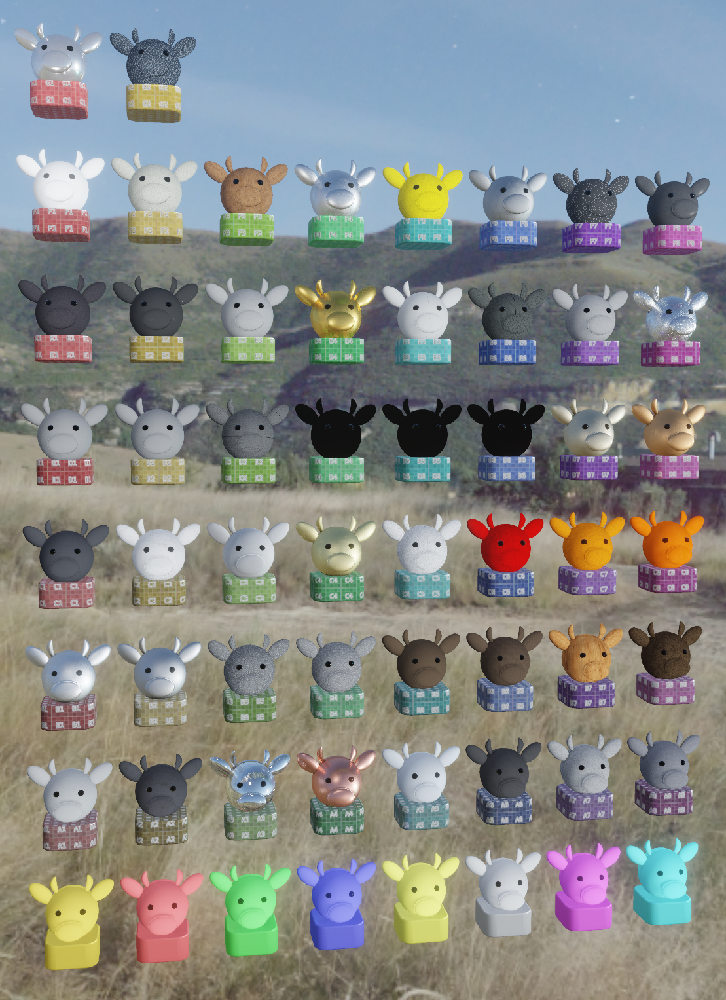

# Giants UDIM Visualization for Blender

This contains 4 materials to simplify the Giants UDIM system for those who work in blender.

There are 2 versions of the vehicleShader.xml system, and 2 versions of the buildingShader.xml system

## Requirements

* Blender 2.93
* Blender 3.x (developed for)

## Installation

Download the blend file, append the material you want into your file.

## VehicleShader.XML

Shown above: `_REAL` for the character, `_GRID` for the base. Material #39 (Metal Diamond Plate), row 4 (E), column 8

There are 2 versions available:

* __GiantsVehicleShader_REAL__ - contains the real in-game texture assets. Reasonably close to how objects will render in the actual game

* __GiantsVehicleShader_GRID__ - uses a color map grid in place of the game assets. This version uses slightly less computer resources to display, may be helpful for large models.

Both versions allow custom user material colors.

### GiantsVehicleShader_REAL

1.) Append the material from the blend file, "GiantsVehicleShader_REAL"
2.) Set the material of your working piece(s) to "GiantsVehicleShader_REAL"

* __UDIM Tile Scale Factor__ allows you to scale the texture on the materials (0-49)
* __colorMat[0-9]__ - Base color for user material 0 - 9
* __colorMat[0-9]Mat__ - Material index for user material 0 - 9 (0 - 49 is valid)

### GiantsVehicleShader_GRID

1.) Append the material from the blend file, "GiantsVehicleShader_GRID"
2.) Set the material of your working piece(s) to "GiantsVehicleShader_GRID"

* __UDIM Tile Scale Factor__ allows you to scale the colorgrid texture on the materials (0-49)
* __UDIM Tile Brightness Scale__ allows you to scale the colorgrid texture on the materials (0-49)
* __colorMat[0-9]__ - Base color for user material 0 - 9

### Exporting

To ease exporting with the community exporter (https://github.com/StjerneIdioten/I3D-Blender-Addon), there are dummy entries for your normal map and vmask.  In both versions, your normal map is applied to the mesh as well for visualization.

## BuildingShader.XML

Similar to the vehicle shader, there are 2 versions of this material available:

* __GiantsBuildingShader-Diffuse__ - mixes pre-set user colors with a loaded diffuse texture file.

* __GiantsBuildingShader-Grid__ - uses a color map grid in place colorScale uv space, and provides a place to set a base color for non-colorSCale uv space.

### __GiantsBuildingShader-Diffuse__

1.) Append the material from the blend file, "GiantsBuildingShader-Diffuse"
2.) Set the material of your working piece to "GiantsBuildingShader-Diffuse"

* __brightScale__ - Control brightness of overlay colors. This is not reflected in-game
* __Diffuse Texture__ - Diffuse texture file
* __colorScale[0-7]__ - Base color for user color space.

### __GiantsBuildingShader-Grid__

1.) Append the material from the blend file, "GiantsBuildingShader-Grid"
2.) Set the material of your working piece to "GiantsBuildingShader-Grid"

* __UVTile Scale__ - relative size of the hash marks
* __UVTile Gamma__ - Controls the brightness of the background grey in the UVTiles
* __Non colorScale Background__ - Base color for non user color space.
